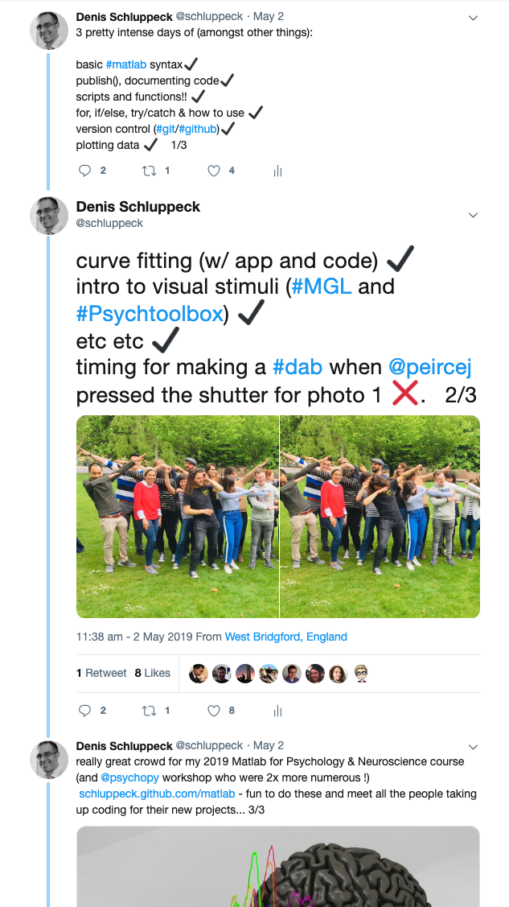

# matlab-2019

A selection of worked solutions to the problem sets in the matlab 2019 course (https://schluppeck.github.com/matlab).

<center>
<a href="https://twitter.com/schluppeck/status/1124020237819633664" target=_new>

</a>
</center>

## visual stimulus coding (day 3)

I captured two videos of the walk through of

1. general idea of visual stimulus generation (very brief intro), followed by constructing a minimal [MGL](https://github.com/justingardner/mgl) example... a toolbox developed by Justin Gardner (now Stanford) and Jonas Larsson (now Royal Holloway, London). People in my lab use this for psychophysics and fMRI experiments.

2. a psychtoolbox redo of something similar (with some additional discussion about how you could turn a script into a more modular thing, but breaking out "presenting a trial" into a separate function)

>Note: this kind of works, but passing all the arguments in as individual
>      arguments could be handled better (we did this as version 1.0 to get it
>      to work... to REFACTOR this [make it better], I would consider passing in
>      info that belongs together e.g. |xCenter, yCenter, ...| as a |struct|, so
>      it is only ONE variable: in SCRIPT "package up" info thus...:

```matlab
  geom.xCenter = xCenter;
  geom.yCenter = yCenter;
  geom.baseRect = baseRect;
  geom.screenXpixels = screenXpixels;
  %etc...
```
>      this would mean only passing 1 variable in (which you can easily change around
>      and pass back out of the function....)

**NB!** you are also very welcome to look at the course material for my MSc Brain imaging module on *Matlab programming* (esp Timetable B version):

- https://github.com/schluppeck/learningMatlab

For the last two coding examples, here are the screen captures with comments. Hope you find them useful:

- [video 1 on youtube](https://www.youtube.com/watch?v=ciHC7WoDpS0&t=5s) - timestamps
  + 0:00 Introduction / overview about drawing stimuli
  + 6:33 MGL, one useful toolbox for doing this in Matlab (``macOS`` only, though)
  + 20:10 nearly working version... just dealing with coordinate system (screen versus visual angle!)
  + 21:10 it's alive!
  + 24:00 another example with MGL that shows how to draw geometric shapes (also has some RGB versus cone-contrast colours, for those interested)
  + 26:30 an example of an **animation** (changing stimulus repeatedly in a loop.)
- [video 2 on youtube](https://youtu.be/WXvQ0Qtk_2E) - timestamps
  + 0:15 pointer to where to find excellent [psychtoolbox](http://psychtoolbox.org/) [tutorials and examples](http://peterscarfe.com/ptbtutorials.html) by Peter Scarfe for all kinds of use cases
  + 2:18 start with an example case of a [moving square](http://peterscarfe.com/movingsquaredemocode.html) (copy & paste into a new script)
  + 6:00 got example running on demo machine (after disabling ``SyncTests``)
  + 20:30 what happens if your hit an error (black screen)
  + 21:40 ``try/catch`` - catching errors
  + 22:50 code folding in editor
  + 25:20 ``try/catch`` catches error and exits script gracefully...
  + 26:30 using the debugger (in matlab editor)
  + 36:00 breaking on the display loop as a separate function: so we can show trials with different parameters on each repetition easily...
  + 59:20 nearly working (fix keyboard issue by adding a short delay at end of trial)
  + 1:00:00 working version: three trials of moving squares, each with a different colour.


## Notes

- https://schluppeck.github.com/matlab
- MGL: http://gru.stanford.edu/doku.php?id=mgl:overview
- Psychtoolbox: http://psychtoolbox.org/
- Matlab/Mathworks: https://uk.mathworks.com/

